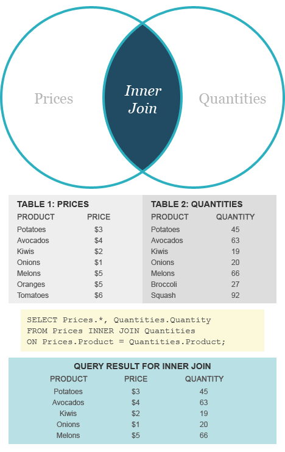
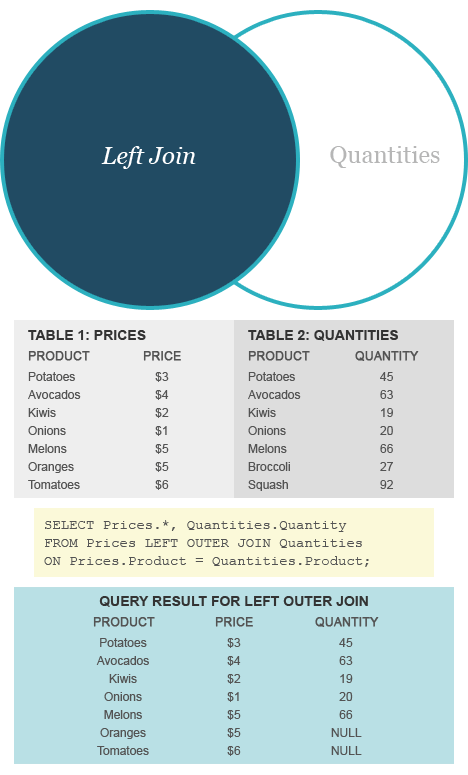
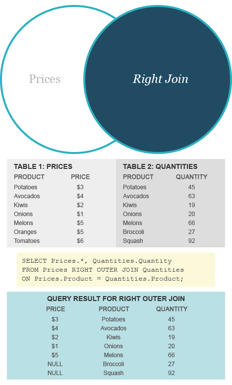
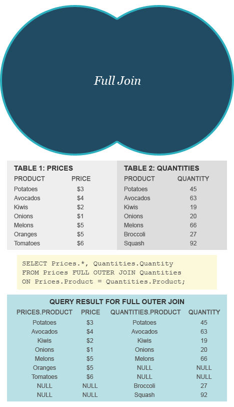
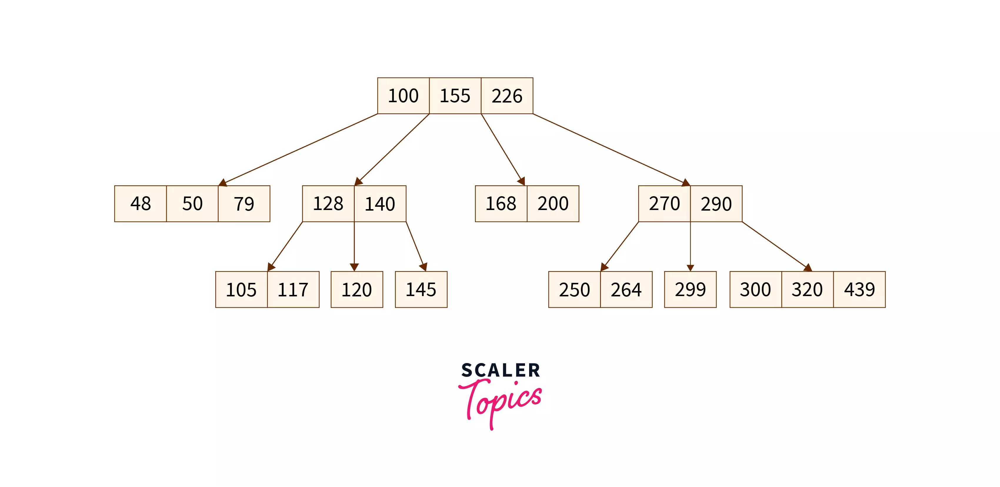

# MySQL interview questions

#### 🤔 What is the difference between primary and foreign key?
- Primary key uniquely identify a relationship in a database, whereas foreign key is the key that is in other relation and it has been referenced from the primary key from other table.
- Primary key remains one only for the table, whereas there can be more than one foreign key.
- Primary key is unique and won’t be shared between many tables, but foreign key will be shared between more than one table and will be used to tell the relationship between them.
- Primary key can not be null, foreign key can be nullable as needed. 

#### 🤔 Difference Between DDL and DML in DBMS?
|DDL|DML|
|-|-|
|It stands for Data Definition Language.|It stands for Data Manipulation Language.|
|It is used to create database schema and can be used to define some constraints as well.|It is used to add, retrieve, or update the data.|
|It basically defines the column (Attributes) of the table.|It adds or updates the row of the table. These rows are called tuples.
|It doesn’t have any further classification.|It is further classified into Procedural and Non-Procedural DML.|
|Basic commands present in DDL are CREATE, DROP, RENAME, ALTER, etc.|BASIC commands present in DML are UPDATE, INSERT, MERGE etc.|
|DDL does not use WHERE clause in its statement.|While DML uses WHERE clause in its statement.|
|DDL is used to define the structure of a database.|DML is used to manipulate the data within the database.|
|DDL is used to create and modify database objects like tables, indexes, views, and constraints.|DML is used to perform operations on the data within those database objects.|
|DDL statements are typically executed less frequently than DML statement|DML statements are frequently executed to manipulate and query data.|
|DDL statements are typically executed by database administrators.|DML statements are typically executed by application developers or end-users.|
|The database’s contents are not altered by DDL commands.|DML commands alter the database’s contents.|
|Examples of DDL commands: CREATE TABLE, ALTER TABLE, DROP TABLE, TRUNCATE TABLE, and RENAME TABLE.|Examples of DML commands: SELECT, INSERT, UPDATE, DELETE, and MERGE.|

#### 🤔 What is Similarity and Difference between Truncate and Delete in SQL?
**Similarity**
- Both Truncate and Delete command will delete data from given table and they will not delete the table structure from the database.

**Differences**
- TRUNCATE is a DDL (data definition language) command whereas DELETE is a DML (data manipulation language) command.

- We can’t execute a trigger with TRUNCATE whereas with DELETE command, a trigger can be executed.

- We can use any condition in WHERE clause using DELETE but it is not possible with TRUNCATE.

- If table is referenced by any foreign key constraints then TRUNCATE cannot work.

- TRUNCATE is faster than DELETE, because when you use DELETE to delete the data, at that time it store the whole data in rollback space from where you can get the data back after deletion, whereas TRUNCATE will not store data in rollback space and will directly delete it. You can’t get the deleted data back when you use TRUNCATE.
- TRUNCATE reset the identity column to its seed value if the table contains an identity column.

#### 🤔 Difference between INNER JOIN and OUTER JOIN?
**Inner Join**
An inner join focuses on the commonality between two tables. When using an inner join, there must be at least some matching data between two (or more) tables that are being compared. 



**Outer Join**
An outer join returns a set of records (or rows) that include what an inner join would return but also includes other rows for which no corresponding match is found in the other table.

There are three types of outer joins:

- Left Outer Join (or Left Join)
- Right Outer Join (or Right Join)
- Full Outer Join (or Full Join)

Each of these outer joins refers to the part of the data that is being compared, combined, and returned. Sometimes nulls will be produced in this process as some data is shared while other data is not.

**Left Join example:**



**Right Join Example:**



**Full Join Example:**



#### 🤔 Name some aggregate functions in MySQL?
- COUNT counts how many rows are in a particular column.
- SUM adds together all the values in a particular column.
- MIN and MAX return the lowest and highest values in a particular column, respectively.
- AVG calculates the average of a group of selected values.

#### 🤔 What is the difference between HAVING clause and WHERE clause?
- WHERE clause is used to filter rows before applying GROUP BY clause, whereas HAVING clause is used to filter values after applying GROUP BY clause.
- WHERE clause can be used with SELECT, UPDATE, DELETE statements, whereas HAVING clause can be used only with SELECT statement.
- WHERE clause is used to filter rows from a table based on the specified condition, whereas HAVING clause is used to filter values from the groups based on the specified condition.

#### 🤔 What is MySQL constraint?
**Constraints are used to specify the rules for data in a table.** Constraints are used to limit the type of data that can go into a table. This ensures the accuracy and reliability of the data in the table. If there is any violation between the constraint and the data action, the action is aborted.

**Constraints can be column level or table level.** Column level constraints apply to a column, and table level constraints apply to the whole table.

The following constraints are commonly used in SQL:
- NOT NULL - Ensures that a column cannot have a NULL value
- UNIQUE - Ensures that all values in a column are different
- PRIMARY KEY - A combination of a NOT NULL and UNIQUE. Uniquely identifies each row in a table
- FOREIGN KEY - Prevents actions that would destroy links between tables
- CHECK - Ensures that the values in a column satisfies a specific condition
- DEFAULT - Sets a default value for a column if no value is specified

#### 🤔 What is the difference between CHAR and VARCHAR?
- CHAR is a fixed length data type, whereas VARCHAR is a variable length data type.
- CHAR takes up 1 byte per character, whereas VARCHAR takes up 1 byte per character + 1 or 2 bytes to store the length of the character string.
- CHAR is used for storing strings with a fixed length, whereas VARCHAR is used for storing strings with a variable length.

#### 🤔 What is indexing in MySQL?
**Indexes are used to retrieve data from the database more quickly than otherwise.** The users cannot see the indexes, they are just used to speed up searches/queries.

**Indexes are used to find rows with specific column values quickly.** Without an index, MySQL must begin with the first row and then read through the entire table to find the relevant rows. The larger the table, the more this costs. If the table has an index for the columns in question, MySQL can quickly determine the position to seek to in the middle of the data file without having to look at all the data. If a table has 1,000 rows, this is at least 100 times faster than reading sequentially. If you need to access most of the rows, it is faster to read sequentially, because this minimizes disk seeks.

**Indexes can be created using one or more columns, providing the basis for both rapid random lookups and efficient ordering of access to records.** An index is a copy of selected columns of data from a table that can be searched very efficiently that also includes a low-level disk block address or direct link to the complete row of data it was copied from.

#### 🤔 What is pros and cons of using indexes in MySQL?
**Pros:**
- Query optimization: Indexes make search queries much faster.
- Uniqueness: Indexes like primary key index and unique index help to avoid duplicate row data.
- Text searching: Full-text indexes in MySQL version 3.23.23, users have the opportunity to optimize searching against even large amounts of text located in any field indexed as such.

**Cons:**
- The indexes take up disk space. Usually the space usage isn’t significant, but because of creating index on every column in every possible combination, the index file would grow much more quickly than the data file. In the case when a table is of large table size, the index file could reach the operating system’s maximum file size.
- Secondly, indexes slow down the speed of writing queries, such as INSERT, UPDATE and DELETE. Because MySQL has to internally maintain the “pointers” to the inserted rows in the actual data file, so there is a performance price to pay when writing data into a table with indexes.

#### 🤔 What is SQL injection?
**SQL injection is a code injection technique that might destroy your database.** SQL injection is one of the most common web hacking techniques.

SQL injection is the placement of malicious code in SQL statements, via web page input.

SQL injection usually occurs when you ask a user for input, like their username/userid, and instead of a name/id, the user gives you an SQL statement that you will unknowingly run on your database.

**Example:**
```sql
SELECT * FROM Users WHERE UserId = 105 OR 1=1;
```
The SQL above is valid and will return ALL rows from the "Users" table, since OR 1=1 is always TRUE.

#### 🤔 How to prevent SQL injection?
**It is very important to sanitize user inputs to your application.** The following methods can be used to achieve this:
- **Using Prepared Statements (Parameterized Queries):** Parameterized queries force the developer to first define all the SQL code, and then pass in each parameter to the query later. This coding style allows the database to distinguish between code and data, regardless of what user input is supplied.
- **Using Stored Procedures:** A stored procedure is a piece of code that is stored in the database and can be executed later. This means that all the business logic will be in the stored procedure, and not in the PHP code. This makes it harder to exploit SQL injection vulnerabilities.
- **Enforcing Least Privilege:** When granting privileges to database accounts, grant only the privileges that are actually needed. For example, if an account is only going to query data, then only grant it SELECT privileges, and nothing else.
- **Escaping All User Supplied Input:** This technique is not recommended, as it is hard to develop, and is error prone. It is also difficult to maintain. However, it is still better than nothing, and it is still widely used.

#### 🤔 What data structure does MySQL use to store indexes?
MySQL uses B-trees for indexes. 


