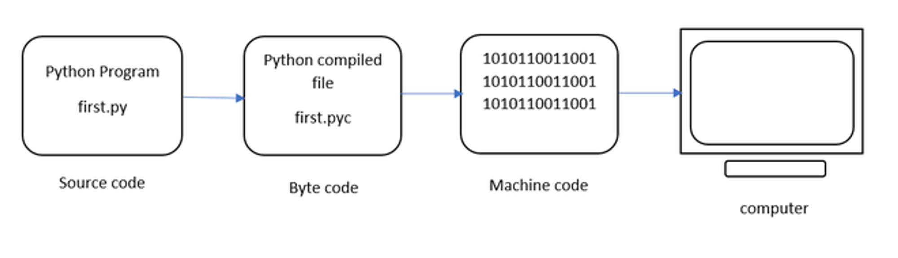

# Python interview questions 

#### 🤔 Explain *args and **kwargs
Although, there is no formal rule on calling them `*args` / `**kwargs`, people tend to name them that way. When a function is declared def `my_func(*args, **kwargs)` , **args** is a tuple with all positional arguments passed to the function and **kwargs** is a dict with all keyword arguments. They can be named anything as long as the unpack operators * and ** are used. 
`*` unpacks a tuple and `**` unpacks a dict.

```py
# *args
def sum_all(*args):
    result = 0
    for num in args:
        result += num
    return result

print(sum_all(1, 2, 3, 4)) 
# Output: 10

# **kwargs
def print_values(**kwargs):
    for key, value in kwargs.items():
        print(f"{key}: {value}")

# Keyword arguments are captured as a dictionary
print_values(name="John", age=30, city="New York")
# Output:
# name: John
# age: 30
# city: New York
```

#### 🤔 How does Python execute code?
This article aims at providing a detailed insight into the execution of the Python program. Let’s consider the below example.
```py
a = 10
b = 10
print("Sum ", (a+b))
> Sum  20
```
Suppose the above python program is saved as **first.py**. Here first is the name and .py is the extension. The execution of the Python program involves 2 Steps:

- Compilation
- Interpreter

**Compilation**
The program is converted into **byte code**. Byte code is a fixed set of instructions that represent arithmetic, comparison, memory operations, etc. It can run on any operating system and hardware. **The byte code instructions are created in the .pyc file.** The .pyc file is not explicitly created as Python handles it internally but it can be viewed with the following command:

```shell
python -m py_compile first.py
```

`-m` and `py_compile` represent module and module name respectively. This module is responsible to generate .pyc file. The compiler creates a directory named `__pycache__` where it stores the **first.cpython-38.pyc** file.

**Interpreter**
The next step involves converting the byte code (.pyc file) into machine code. This step is necessary as the computer can understand only machine code (binary code). **Python Virtual Machine** (PVM) first understands the operating system and processor in the computer and then converts it into machine code. Further, these machine code instructions are executed by processor and the results are displayed.



*Execution of Python Program*

However, the interpreter inside the PVM translates the program line by line thereby consuming a lot of time. To overcome this, a compiler known as Just In Time (JIT) is added to PVM. JIT compiler improves the execution speed of the Python program. This compiler is not used in all Python environments like CPython which is standard Python software.

To execute the first.cpython-38.pyc we can use the following command:
```
python first.cpython-38.pyc
> Sum 20
```

To view the byte code of the file – first.py we can type the following command as:
```
python -m dis first.py
```

The `dis` command is known as **disassembler** that displays the byte code in an understandable format. The code represents 5 columns:

1. Line Number
2. offset position of byte code
3. name of byte code instruction
4. instruction’s argument
5. constants or names (in brackets)

#### 🤔 What is the difference between deep and shallow copy?
In Python, the assignment statement (= operator) does not copy objects. Instead, it creates a binding between the existing object and the target variable name. To create copies of an object in Python, we need to use the `copy` module. Moreover, there are two ways of creating copies for the given object using the copy module:

**Shallow copy** is used when a new instance type gets created and it keeps the values that are copied in the new instance. Shallow copy is used to copy the reference pointers just like it copies the values. These references point to the original objects and the changes made in any member of the class will also affect the original copy of it. Shallow copy allows faster execution of the program and it depends on the size of the data that is used.

**Deep copy** is used to store the values that are already copied. Deep copy doesn’t copy the reference pointers to the objects. It makes the reference to an object and the new object that is pointed by some other object gets stored. The changes made in the original copy won’t affect any other copy that uses the object. Deep copy makes execution of the program slower due to making certain copies for each object that is been called.

```py
from copy import copy, deepcopy
list_1 = [1, 2, [3, 5], 4]
## shallow copy
list_2 = copy(list_1) 
list_2[3] = 7
list_2[2].append(6)
list_2    # output => [1, 2, [3, 5, 6], 7]
list_1    # output => [1, 2, [3, 5, 6], 4]
## deep copy
list_3 = deepcopy(list_1)
list_3[3] = 8
list_3[2].append(7)
list_3    # output => [1, 2, [3, 5, 6, 7], 8]
list_1    # output => [1, 2, [3, 5, 6], 4]
```

#### 🤔 What is break, continue and pass in Python?
|Keyword|Usage|
|-|-|
|Break|The `break` statement terminates the loop immediately and the control flows to the statement after the body of the loop.|
|Continue|The `continue` statement terminates the current iteration of the statement, skips the rest of the code in the current iteration and the control flows to the next iteration of the loop.|
|Pass|the `pass` statement instructs to do nothing, and the remainder of the code executes as usual.|

#### 🤔 What are lists and tuples? What is the key difference between the two?
**Lists and Tuples are both sequence data types that can store a collection of objects in Python.** The objects stored in both sequences can have different data types. Lists are represented with square brackets `['sara', 6, 0.19]`, while tuples are represented with parantheses `('ansh', 5, 0.97)`.
But what is the real difference between the two? The key difference between the two is that while **lists are mutable, tuples on the other hand are immutable objects**. This means that lists can be modified, appended or sliced on the go but tuples remain constant and cannot be modified in any manner. You can run the following example on Python IDLE to confirm the difference:
```py
my_tuple = ('sara', 6, 5, 0.97)
my_list = ['sara', 6, 5, 0.97]
print(my_tuple[0])    # output => 'sara'
print(my_list[0])     # output => 'sara'
my_tuple[0] = 'ansh'  # modifying tuple => throws an error
my_list[0] = 'ansh'   # modifying list => list modified
print(my_tuple[0])    # output => 'sara'
print(my_list[0])     # output => 'ansh'
```
**When to Use Each?**
- Lists are ideal for collections that may change in size and content. They are the preferred choice for storing data elements.

- Tuples, due to their immutability and enhanced performance, are a good choice for representing fixed sets of related data.

#### 🤔 What is the difference between == and is operator in Python?
Both the `==` and `is` operators in Python are used for comparison, but they function differently.

The `==` operator checks for value equality.
The `is` operator, on the other hand, validates object identity

In Python, every object is unique, identifiable by its memory address. The `is` operator uses this memory address to check if two objects are the same, indicating they both point to the exact same instance in memory.

- `is` Compares the memory address or identity of two objects.
- `==` Compares the content or value of two objects.

#### 🤔 Three different ways to fetch every 3rd item of a list?

```py
# Using index jump
example_list = [0,1,2,3,4,5,6]
example_list = [::3] 
# returns [0,3,6]

# Using list comphrehension
[x for x in example_list if example_list.index(x)%3==0]
# [0,3,6]

# Using while loop
i = 0
while i < len(example_list):
    print(example_list[i])
    i += 3
# 0 3 6
```

#### 🤔 What is the difference between staticmethod and classmethod?
|Parameter|Class Method|Static Method|
|-|-|-|
|Decorator|@classmethod|@staticmethod|
|Use Case|More widely used as a factory method to class|Acts as utility functions|
|Scope|Bound to the classs and not objects|Also bound to class and not objects|
|Behaviour|Can modify the state of the class|Can't access class state|
|Parameter|Takes cls as first parameter|No specific parameter|

```py
class Circle:
    no_of_circles = 0
    def __init__(self, radius):
        self.radius = radius
        Circle.no_of_circles += 1
        
    @staticmethod
    def square(num):
        return num**2
    
    @classmethod
    def getCircleCount(cls):
        return cls.no_of_circles
```